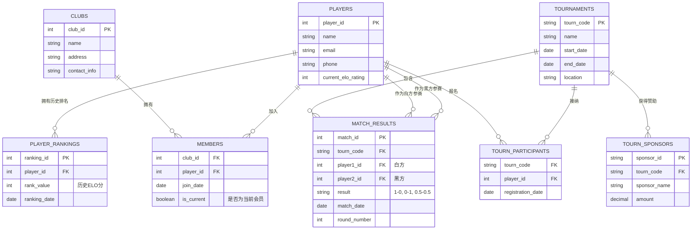

# 数据开发工程师笔试项目 README
## 项目概述
### 本项目为数据开发工程师笔试题的实现代码，包含三个核心任务：
1. Nginx 日志分析（HTTPS 请求域名统计、按日期统计请求成功率）
2. 游戏关卡事件数据生成与 SQL 查询准备
3. 国际象棋比赛数据模型设计（仅需求文档，无代码实现）

## 目录结构
```
joycastle_exam_0130/
├── test1/                 # Nginx 日志分析任务
│   ├── analyze_nginx_logs.py  # 日志统计核心代码
│   └── nginx.log               # 示例日志文件
├── test2/                 # 游戏关卡事件数据任务
│   ├── event_log_insert.py     # 批量生成事件数据（SQLite）
│   └── stat_by_time.py         # 按时间维度统计数据
└── test3/                 # 国际象棋比赛数据模型任务
    └── object.md            # 数据模型设计文档（Jupyter Notebook）
```
## 任务细节与使用说明
### 1. Nginx 日志分析（test1/）
#### 功能
统计 域名(domain.com) 来源的 HTTPS 请求数量，统计指定日期的请求成功率
#### 使用方法
1. 替换代码中日志文件路径为你的实际路径
2. 直接运行脚本：
```
python .\test1\analyze_nginx_logs.py
```
3. 脚本会输出：
    1. 指定日期的总请求数
    2. 成功请求数（状态码 2xx/3xx）
    3. 请求成功率
    4. domain1.com 来源的请求数
### 2. 游戏关卡事件数据任务（test2/）
#### 功能
批量生成游戏关卡开启事件数据并写入 SQLite 数据库
支持按时间维度统计用户行为
#### 使用方法
1. 生成测试数据：
```
python .\test2\event_log_insert.py
```
2. 按时间维度统计：
```
python .\test2\stat_by_time.py
```
3. SQL 查询示例（统计 2020 年 9 月关卡开启数在 1000-2000 之间的用户数）：
``` mysql
SELECT COUNT(*)
FROM (
    SELECT user_id, COUNT(*) AS level_open_count
    FROM event_log
    WHERE event_timestamp >= UNIX_TIMESTAMP('2020-09-01 00:00:00')
      AND event_timestamp < UNIX_TIMESTAMP('2020-10-01 00:00:00')
    GROUP BY user_id
    HAVING level_open_count >= 1000 AND level_open_count < 2000
) AS user_counts;
```
### 3. 国际象棋比赛数据模型设计（test3/）
#### 业务规则
1. 俱乐部与棋手是多对多关系，通过会员表记录，支持历史关系追踪
2. 棋手可参加多个锦标赛，锦标赛可接纳多个棋手
3. 比赛结果需记录黑白双方信息、比分、轮次等
4. 需追踪棋手历史 ELO 排名
#### 核心表结构


### 注意事项
1. analyze_nginx_logs 支持处理千万级日志文件，采用逐行读取+字符串匹配的高效处理方式，避免内存溢出
2. 数据生成脚本默认生成 1.8亿条测试数据，可通过修改 TOTAL_ROWS 参数调整，并且添加索引
3. 所有时间处理均采用 UTC 时区，避免时区转换误差

