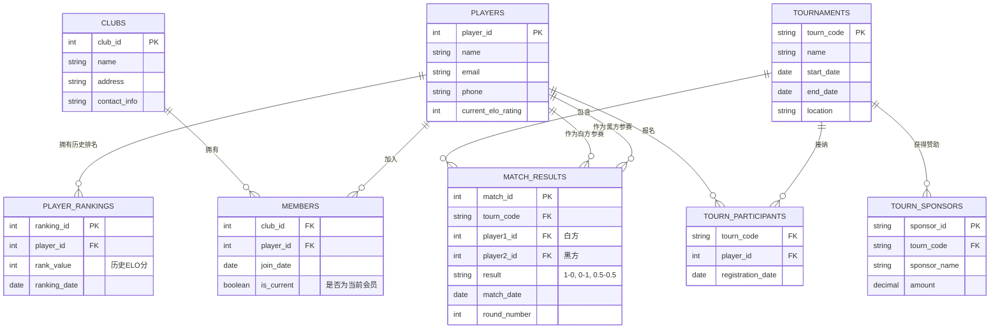

# 国际象棋比赛数据模型设计
根据业务规则，我们可以设计出包含8张核心表的关系型数据库模型，同时通过ER图展示表之间的关联关系：
## 实体-关系图(ERD)

### 图解说明
1. 多对多关系的拆解：
    1. 会员关系 (MEMBERS) ：一个俱乐部有多个棋手，一个棋手也可以曾属于多个俱乐部（历史记录）。通过 is_current 字段标记当前归属。
    2. 参赛关系 (TOURN_PARTICIPANTS) ：棋手可以参加多个比赛，比赛也有多个棋手。
2. 核心业务表 (MATCH_RESULTS) ：
   1. 这是数据量最大的表。它连接了 TOURNAMENTS（哪场比赛）和 PLAYERS（哪两个人）。
   2. 注意：这里有两条线连接到 PLAYERS 表，分别代表 白方 (player1) 和 黑方 (player2) 。
3. 排名系统 (PLAYER_RANKINGS) ：
   这是一个历史记录表，用于追踪棋手积分随时间的变化趋势（例如每月存档一次）。
## 详细表结构设计
### 1. 俱乐部表(clubs) 
存储俱乐部基础信息
```sql
CREATE TABLE clubs (
    club_id INT PRIMARY KEY AUTO_INCREMENT COMMENT '俱乐部唯一ID',
    name VARCHAR(100) NOT NULL COMMENT '俱乐部名称',
    address VARCHAR(255) COMMENT '俱乐部地址',
    details TEXT COMMENT '俱乐部其他详情（如简介、联系方式等）',
    created_at TIMESTAMP DEFAULT CURRENT_TIMESTAMP COMMENT '记录创建时间'
);
```

### 2. 棋手表(players) 
存储棋手个人信息
```
CREATE TABLE players (
    player_id INT PRIMARY KEY AUTO_INCREMENT COMMENT '棋手唯一ID',
    name VARCHAR(100) NOT NULL COMMENT '棋手姓名',
    address VARCHAR(255) COMMENT '棋手联系地址',
    details TEXT COMMENT '棋手其他详情（如出生日期、等级分历史等）',
    created_at TIMESTAMP DEFAULT CURRENT_TIMESTAMP COMMENT '记录创建时间'
);
```

### 3. 会员关系表(members) 
记录棋手与俱乐部的绑定关系，满足"一个棋手在任何时候只能是一个俱乐部的会员"的业务规则
```
CREATE TABLE members (
    member_id INT PRIMARY KEY AUTO_INCREMENT COMMENT '会员记录ID',
    player_id INT NOT NULL COMMENT '关联棋手ID',
    club_id INT NOT NULL COMMENT '关联俱乐部ID',
    join_date DATE NOT NULL COMMENT '入会日期',
    membership_type VARCHAR(50) COMMENT '会员类型（如正式会员、荣誉会员等）',
    is_current BOOLEAN DEFAULT TRUE COMMENT '是否当前会员',
    FOREIGN KEY (player_id) REFERENCES players(player_id) ON DELETE CASCADE,
    FOREIGN KEY (club_id) REFERENCES clubs(club_id) ON DELETE CASCADE,
    -- 唯一约束确保同一时间一个棋手只能加入一个俱乐部
    UNIQUE KEY uk_current_member (player_id, is_current)
);
```

### 4. 棋手排名表(player_rankings) 
记录棋手的官方排名信息，满足"一个棋手可以有一个且只有一个排名"的业务规则
```
CREATE TABLE members (
    member_id INT PRIMARY KEY AUTO_INCREMENT COMMENT '会员记录ID',
    player_id INT NOT NULL COMMENT '关联棋手ID',
    club_id INT NOT NULL COMMENT '关联俱乐部ID',
    join_date DATE NOT NULL COMMENT '入会日期',
    membership_type VARCHAR(50) COMMENT '会员类型（如正式会员、荣誉会员等）',
    is_current BOOLEAN DEFAULT TRUE COMMENT '是否当前会员',
    FOREIGN KEY (player_id) REFERENCES players(player_id) ON DELETE CASCADE,
    FOREIGN KEY (club_id) REFERENCES clubs(club_id) ON DELETE CASCADE,
    -- 唯一约束确保同一时间一个棋手只能加入一个俱乐部
    UNIQUE KEY uk_current_member (player_id, is_current)
);
```

### 5. 锦标赛表(tournaments) 
存储锦标赛基础信息
```
CREATE TABLE tournaments (
    tourn_code VARCHAR(50) PRIMARY KEY COMMENT '锦标赛唯一代码',
    name VARCHAR(200) NOT NULL COMMENT '锦标赛名称',
    start_date DATE NOT NULL COMMENT '锦标赛开始日期',
    end_date DATE NOT NULL COMMENT '锦标赛结束日期',
    max_players INT COMMENT '最大参赛人数限制',
    location VARCHAR(255) COMMENT '比赛地点',
    details TEXT COMMENT '锦标赛其他详情'
);
```

### 6. 锦标赛赞助关系表(tourn_sponsors) 
记录锦标赛的多个赞助方信息，满足"锦标赛可以有零个、一个或多个赞助方"的业务规则
```
CREATE TABLE tourn_sponsors (
    sponsor_id INT PRIMARY KEY AUTO_INCREMENT COMMENT '赞助记录ID',
    tourn_code VARCHAR(50) NOT NULL COMMENT '关联锦标赛代码',
    sponsor_name VARCHAR(100) NOT NULL COMMENT '赞助方名称',
    sponsor_type VARCHAR(50) COMMENT '赞助类型（企业/政府/个人等）',
    sponsorship_amount DECIMAL(10,2) COMMENT '赞助金额',
    FOREIGN KEY (tourn_code) REFERENCES tournaments(tourn_code) ON DELETE CASCADE
);
```

### 7.锦标赛参赛关系表(tourn_players) 
记录棋手与锦标赛的关联关系，满足"棋手可以参加零次或多次锦标赛"和"一个锦标赛可以有许多棋手"的业务规则
```
CREATE TABLE tourn_players (
    entry_id INT PRIMARY KEY AUTO_INCREMENT COMMENT '参赛记录ID',
    tourn_code VARCHAR(50) NOT NULL COMMENT '关联锦标赛代码',
    player_id INT NOT NULL COMMENT '关联棋手ID',
    entry_date DATE NOT NULL COMMENT '报名日期',
    entry_status VARCHAR(50) DEFAULT 'approved' COMMENT '参赛状态（已报名/已通过/已取消等）',
    FOREIGN KEY (tourn_code) REFERENCES tournaments(tourn_code) ON DELETE CASCADE,
    FOREIGN KEY (player_id) REFERENCES players(player_id) ON DELETE CASCADE,
    -- 唯一约束确保同一棋手同一锦标赛只能报名一次
    UNIQUE KEY uk_tourn_player (tourn_code, player_id)
);
```

### 8.比赛记录表(match_results) 
存储锦标赛中的具体比赛信息，满足"一个锦标赛可以有在两个参赛棋手之间进行的零场或多场比赛"的业务规则
```
CREATE TABLE match_results (
    match_id INT PRIMARY KEY AUTO_INCREMENT COMMENT '比赛记录ID',
    tourn_code VARCHAR(50) NOT NULL COMMENT '关联锦标赛代码',
    player1_id INT NOT NULL COMMENT '参赛棋手1ID',
    player2_id INT NOT NULL COMMENT '参赛棋手2ID',
    winner_id INT COMMENT '获胜棋手ID（NULL表示平局）',
    match_date DATETIME NOT NULL COMMENT '比赛日期时间',
    score VARCHAR(20) COMMENT '比赛比分记录（如1-0、0.5-0.5等）',
    match_round INT COMMENT '比赛轮次',
    FOREIGN KEY (tourn_code) REFERENCES tournaments(tourn_code) ON DELETE CASCADE,
    FOREIGN KEY (player1_id) REFERENCES players(player_id) ON DELETE CASCADE,
    FOREIGN KEY (player2_id) REFERENCES players(player_id) ON DELETE CASCADE,
    FOREIGN KEY (winner_id) REFERENCES players(player_id) ON DELETE SET NULL
);
```

## 索引优化
为了提高数据库的查询性能，针对上述国际象棋比赛数据模型，我们需要在外键关联（JOIN） 、常用查询字段（WHERE） 以及排序字段（ORDER BY） 上创建索引。

### 外键关联优化（JOIN性能）
在多表连接查询时，外键字段如果没有索引，会导致全表扫描，严重影响性能。
```sql
CREATE INDEX idx_members_club_id ON members(club_id);
CREATE INDEX idx_members_player_id ON members(player_id);

CREATE INDEX idx_player_rankings_player_id ON player_rankings(player_id);

CREATE INDEX idx_sponsors_tourn_code ON tourn_sponsors(tourn_code);

CREATE INDEX idx_tourn_players_player_id ON tourn_players(player_id);
CREATE INDEX idx_tourn_players_tourn_code ON tourn_players(tourn_code);

CREATE INDEX idx_matches_tourn_code ON match_results(tourn_code);
CREATE INDEX idx_matches_player1 ON match_results(player1_id);
CREATE INDEX idx_matches_player2 ON match_results(player2_id);
```
### 基础查询优化 针对用户经常需要通过名称搜索id的情况。
针对用户经常需要通过名称搜索俱乐部、棋手或赛事的情况。
```
CREATE INDEX idx_clubs_name ON clubs(name);
CREATE INDEX idx_players_name ON players(name);
CREATE INDEX idx_tournaments_name ON tournaments(name);
```

### 业务逻辑与排序优化
针对排行榜、时间范围查询等特定业务场景。
```
CREATE INDEX idx_matches_date ON match_results(match_date);
CREATE INDEX idx_rankings_value ON player_rankings(rank_value);
CREATE INDEX idx_tournaments_dates ON tournaments(start_date, end_date);
```
